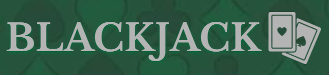
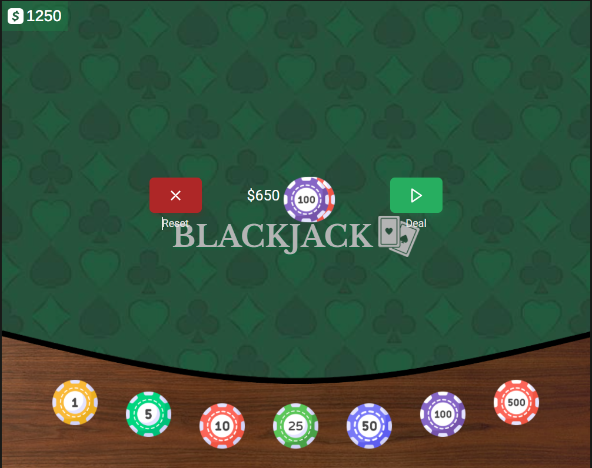
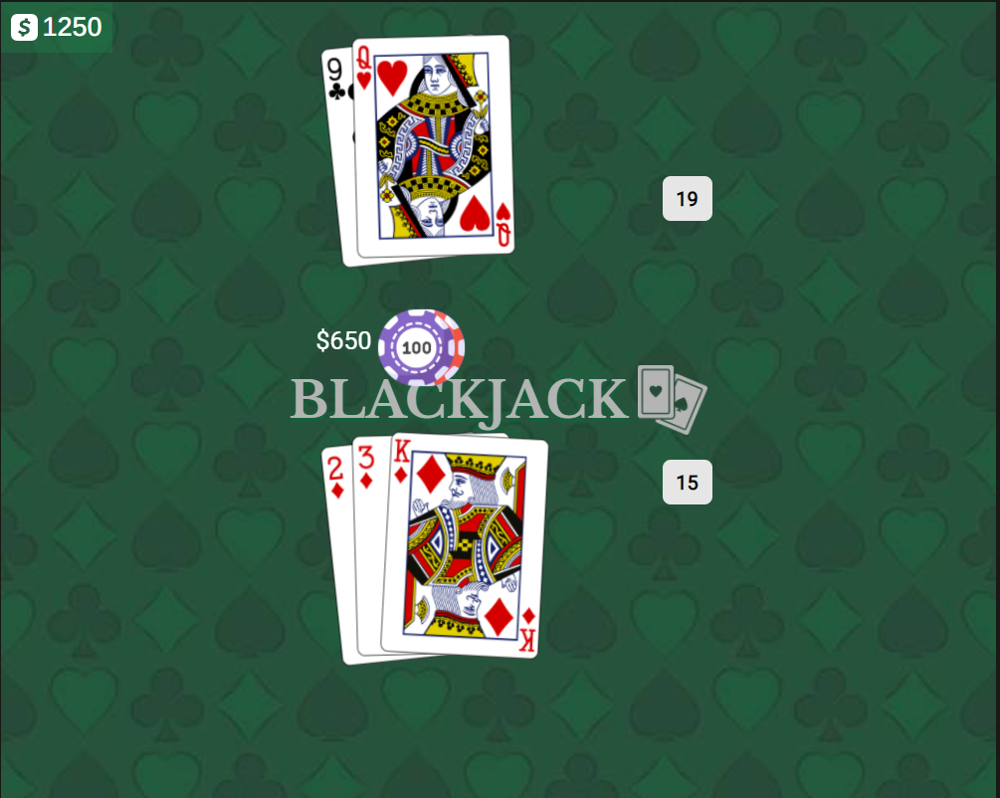
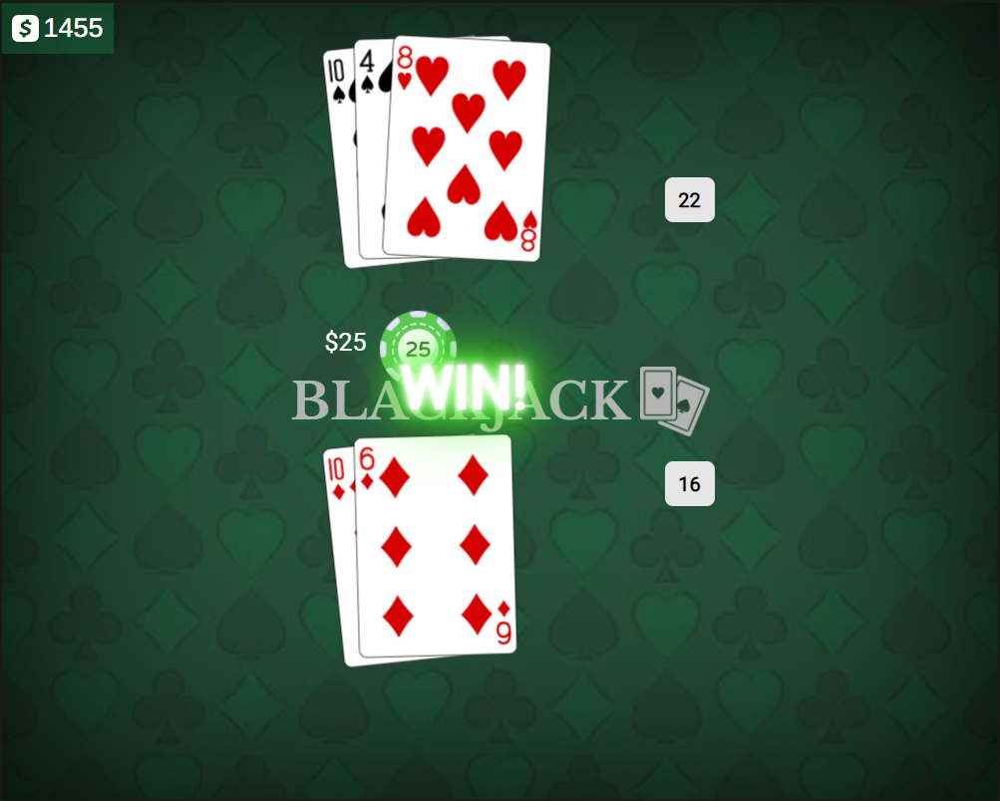

# <BlackJack-Game>

## About

BlackJack is a casino card game. The most widely played casino banking game in the world. It uses decks of 52 cards and descends from a global family of casino banking games known as Twenty-One. The game is a comparing card game where each player competes against the dealer.

## Demo

 Here is a working live demo : [DEMO](https://marcin082.github.io/blackjack-game/)





## Game Rules
* The goal of blackjack is to beat the dealer's hand without going over 21.
* Face cards are worth 10. Aces are worth 1 or 11, whichever makes a better hand.
* Each player starts with two cards, one of the dealer's cards is hidden until the end.
* To 'Hit' is to ask for another card. To 'Stand' is to hold your total and end your turn.
* If you are dealt 21 from the start (Ace & 10), you got a blackjack.

## Built with

* TypeScrpit
* Scss modules
* React
* React Redux
* [CardsApi](https://deckofcardsapi.com/)

## Installation

### Install Node JS
Refer to [https://nodejs.org/en/](https://nodejs.org/en/) to install nodejs

### Install create-react-app
Install create-react-app npm package globally. This will help to easily run the project and also build the source files easily. Use the following command to install create-react-app

```bash
npm install -g create-react-app
```

## Cloning and Running the Application in local

Clone the project into local

Install all the npm packages. Go into the project folder and type the following command to install all npm packages

```bash
npm install
```

In order to run the application Type the following command

```bash
npm start
```

The Application Runs on **localhost:3000**

